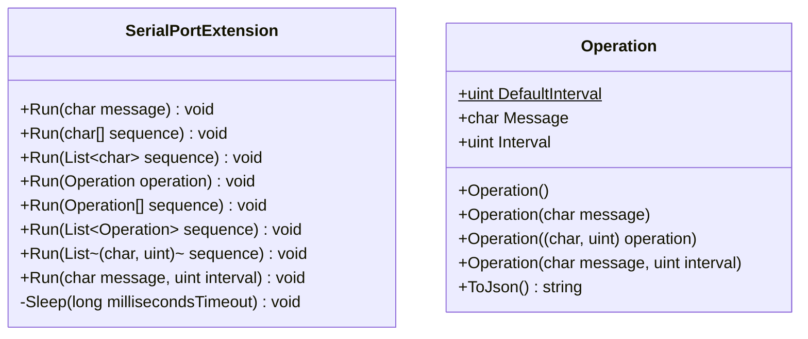
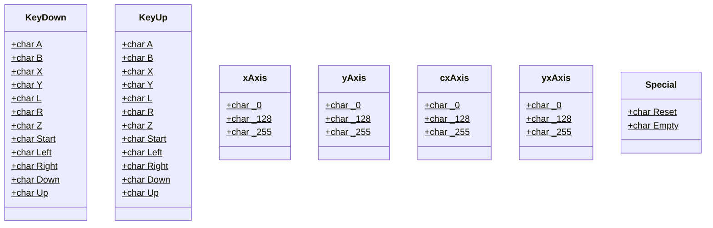

# Narwhal

Provides NINTENDO GAMECUBE controller emulation via Arduino.

Based on [WHALE](https://github.com/mizuyoukanao/WHALE) by mizuyoukanao.

## Usage

```cs
using System.Text.Json;
using Narwhal;

using (var controller = new SerialPort("COM6", 4800))
{
    controller.Open();
    
    // Press A
    // (interval: 100ms by default)
    controller.Run(KeyDown.A);

    // Release A and wait 200ms
    controller.Run(KeyUp.A, 200);

    // dR -> hold A 500ms -> B
    controller.Run(new Operation[]
    {
        new Operation(KeyDown.Right),
        new Operation(KeyUp.Right),
        new Operation(KeyDown.A, 500),
        new Operation(KeyUp.A),
        new Operation(KeyDown.B),
        new Operation(KeyUp.B)
    });

    // same as above
    controller.Run(new List<(char, uint)>
    {
        (KeyDown.Right, Operation.DefaultInterval),
        (KeyUp.Right,   Operation.DefaultInterval),
        (KeyDown.A,     500),
        (KeyUp.A,       Operation.DefaultInterval),
        (KeyDown.B,     Operation.DefaultInterval),
        (KeyUp.B,       Operation.DefaultInterval)
    });

    // Deserialize from JSON
    var json = @"[{""command"":""a"",""interval"":100},{""command"":""m"",""interval"":100}]";
    var sequences = JsonSerializer.Deserialize<Operation[]>(json);
    if (sequences != null) controller.Run(sequences);
}
```

## Diagram




